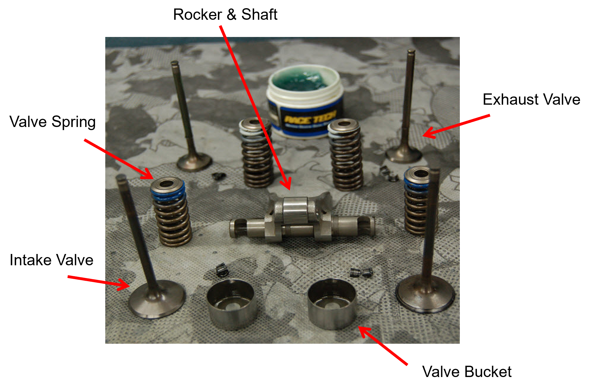
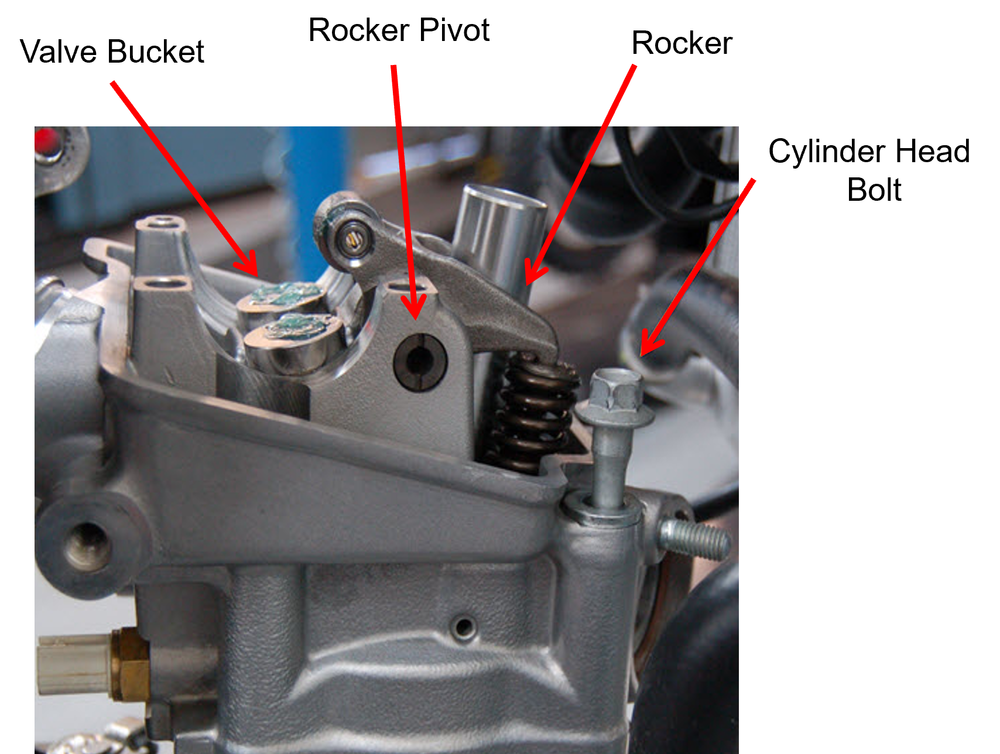
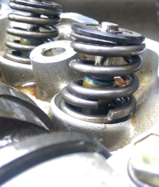
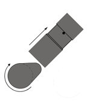
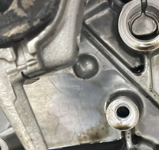

# Phase 1 – System Understanding and Conceptual Design

## Executive Summary
This report examines how a Unicam-style overhead cam valve train system works, its key components, and potential failure points. The valvetrain is a critical component in a four-stroke engine assembly, as it controls the timing and motion of the intake and exhaust valves. The valves regulate the air-fuel mixture entering the combustion chamber and the exhaust gases leaving it.  

In this specific system, a single camshaft operates directly on the intake valves while using a rocker to actuate the exhaust valves, allowing for precise valve timing with fewer moving parts. This design reduces inertia in the valvetrain, helping prevent valve float at high engine speeds and improving overall engine efficiency.

### Four-Stroke Engine Overview

A four-stroke engine completes a power cycle in four distinct strokes of the piston: intake, compression, combustion, and exhaust.

1. **Intake Stroke:** The intake valve opens, and the piston moves down the cylinder, drawing in the air-fuel mixture.  
2. **Compression Stroke:** Both valves are closed, and the piston moves up, compressing the mixture to increase pressure and temperature for efficient combustion.  
3. **Power Stroke:** The spark plug ignites the compressed mixture, forcing the piston downward and generating torque on the crankshaft.  
4. **Exhaust Stroke:** The exhaust valve opens, and the piston moves up again, expelling the spent gases from the cylinder.  

This cycle repeats for each cylinder, with the camshaft coordinating valve opening and closing so that intake and exhaust events occur at the correct crank angles. In multi-cylinder engines, the strokes are staggered to ensure smooth power delivery. 

  

---

## System Function and Decomposition
**Overall function:** Convert crankshaft rotation into precisely phased valve motion (lift, dwell, and seating) to control cylinder air exchange (intake and exhaust) during the four-stroke combustion cycle. The valvetrain ensures that intake valves open at the correct moment to admit the optimal air-fuel mixture and close in time to maximize compression efficiency. Simultaneously, exhaust valves open to release combustion gases efficiently, minimizing residual heat and preventing backflow.  

This precise timing is critical at high engine speeds, where even slight deviations can reduce volumetric efficiency, cause valve float, or create interference with piston motion. The Unicam design allows a single camshaft to directly actuate the intake valves while using a rocker arm to drive the exhaust valves, reducing moving mass and inertia in the system. By controlling lift profiles, dwell periods, and seating forces, the system maintains engine performance, durability, and efficiency across the full operating range, including operating speeds up to 13,000 RPM, while minimizing wear and the risk of component failure.

The images below show a CRF250 cylinder head with arrows identifying the key components of the valvetrain.  

- The first image shows the fully assembled cylinder head, illustrating how the camshaft, valves, rocker arms, and other components fit together in the system.  
- The second image shows the disassembled valves, including valve springs, valve buckets, and guides, as well as the rocker.  
- The third image focuses on the assembled valves and their associated components, showing the direct contact points between the cam, rocker, and valves.  

These visual aids help to understand the layout and interactions of the components, as well as the paths of motion through the valvetrain during operation.

 
   

  

  

---

## Component Breakdown
| Component | Image |
|:----------|:--------|
| **Cylinder Head**  
This component provides the structural support and alignment for the camshaft bearings, valve guides, and rocker arm pivots. |  |
| **Camshaft**  
Controls valve timing and lift. Intake valves are directly actuated via cam–follower contact, while exhaust valves are actuated through cam–rocker contact. |  |
| **Rocker Arm**  
Transfers cam motion to the exhaust valves, allowing a more compact system layout. |  |
| **Valves**  
Intake valves allow the air–fuel mixture in, while exhaust valves release combustion gases. Valves are subjected to repeated impact loading, bending, and high-cycle fatigue. |  |
| **Valve Springs**  
Close the valve after cam actuation and maintain follower contact. Made from chrome-silicon steel for fatigue resistance at high RPM. |  |
| **Valve Guides**  
Maintain valve alignment and facilitate heat transfer to the cylinder head. Excessive wear can cause oil consumption and poor sealing. |  |
| **Valve Bucket (Follower)**  
Transmits cam motion while reducing friction and wear; maintains proper lift and alignment in the valvetrain. |  |
| **Timing Chain**  
Synchronizes camshaft and crankshaft motion, using guides and a tensioner to maintain proper tension and reduce vibration. |  |
| **Camshaft Bearings**  
Support the camshaft and transfer loads to the cylinder head, reducing friction and ensuring smooth rotation at high RPM. |  |

---

## Kinematics
Kinematics describes how rotational input at the crankshaft produces cam motion and valve lift. For a four-stroke engine, each cylinder completes one intake and one exhaust event every two crank revolutions.

### Camshaft Speed Relationship (Four-Stroke)
The camshaft rotates at half the crankshaft speed: `omega_cam = 0.5 * omega_crank`.  
This is achieved via the timing drive (sprocket tooth ratio or gear ratio), so the cam completes one revolution per 720° of crank rotation. If the sprocket teeth are known, the ratio can be expressed as: `omega_cam / omega_crank = N_crank / N_cam`.
Where N = Number of teeth

### Valve Lift
Valve lift is determined by cam lobe geometry and the follower/rocker mechanism:

- **Direct-acting follower:** `L_valve ≈ L_cam`  
- **Rocker-actuated valve:** `L_valve ≈ R * L_cam`, where `R = (rocker output lever) / (input lever)`

> For Phase 2, peak valve acceleration and spring force checks may be needed. Compute follower displacement from the cam profile, then differentiate to get velocity and acceleration versus cam angle.

### Key Kinematic Checks
- Confirm timing: intake opens/closes, exhaust opens/closes at intended crank angles.  
- Ensure maximum valve lift meets flow requirements without coil bind or retainer/guide interference.  
- Check valve-to-piston clearance at overlap and near TDC on compression.  
- Evaluate valve float risk at target RPM (based on spring rate, mass, acceleration).  
- Confirm lash (clearance) range accounts for thermal growth and wear.

---

## Preliminary Failure Mode Review

### Spring Fatigue
Over long periods, cyclic loading of the valve springs can lead to fatigue and eventual failure, reducing their ability to properly control the valves. Spring failure may cause gear wear and misalignment of the camshaft.  

**Mitigation:** Use springs with improved cyclic loading properties or replace/repair routinely.  

  

### Valve Float
Occurs when valve springs cannot close the valve fast enough at high RPMs, causing loss of contact with the cam lobe and potential valve-to-piston contact.  

**Mitigation:** Use more robust valve springs or reduce engine RPMs.  

  

### Thermal Expansion
Heat from combustion and friction causes parts to expand/contract, altering clearances. Can prevent proper valve seating and increase wear.  

**Mitigation:** Use materials with low or matched thermal expansion.  

  

### General Wear
Continuous motion and contact cause material wear, degrading valve profiles and system performance over time.  

**Mitigation:** Perform routine maintenance, including lifter cleaning and lubrication.  

  

---

## Critical Design Parameters

### Geometry that Controls Motion
- **Cam lobe geometry:** base circle, max lift, duration, ramp shape  
  - Drives: valve lift curve, peak acceleration, contact loading  
- **Rocker geometry & ratio:** pivot location, lever arms, pad radii  
  - Drives: exhaust lift scaling, bending stress, contact stress at tip  
- **Valve geometry & spacing:** stem diameter, head diameter, valve angles, center spacing  
  - Drives: packaging, valve mass and inertia, alignment and side loading  

> Ensures proper scale and interference-free fit.

### Spring and Dynamic Inputs (for Failure Analysis)
- **Spring specs:** rate (k), preload, installed height, max compression, coil-bind margin  
  - Drives: seating force, valve-float margin, peak forces on 3D printed parts  
- **Operating speed & moving mass:** target cam speed, RPM, follower, rocker, valve effective mass  
  - Drives: inertia loads (F=ma), fatigue-like cycling risk  

> Needed for proper analysis of the model.

### Print-Driven Design Constraints
- **Material & process:** resin or filament printing, wall thickness, infill, minimum feature size  
  - Drives: part strength, layer-line failure, creep, durability  
- **Critical fits & clearances:** valve lash, stem-guide clearance, rocker pivot clearance, cam bore/bearing fits  
  - Drives: binding vs impact loads, timing accuracy, wear rate  
- **Packaging & clearance envelope:** full-motion interference check across max lift and rocker sweep  
  - Drives: collision prevention, assembly feasibility  

> Ensures printed parts fit and function correctly without assembly issues.
