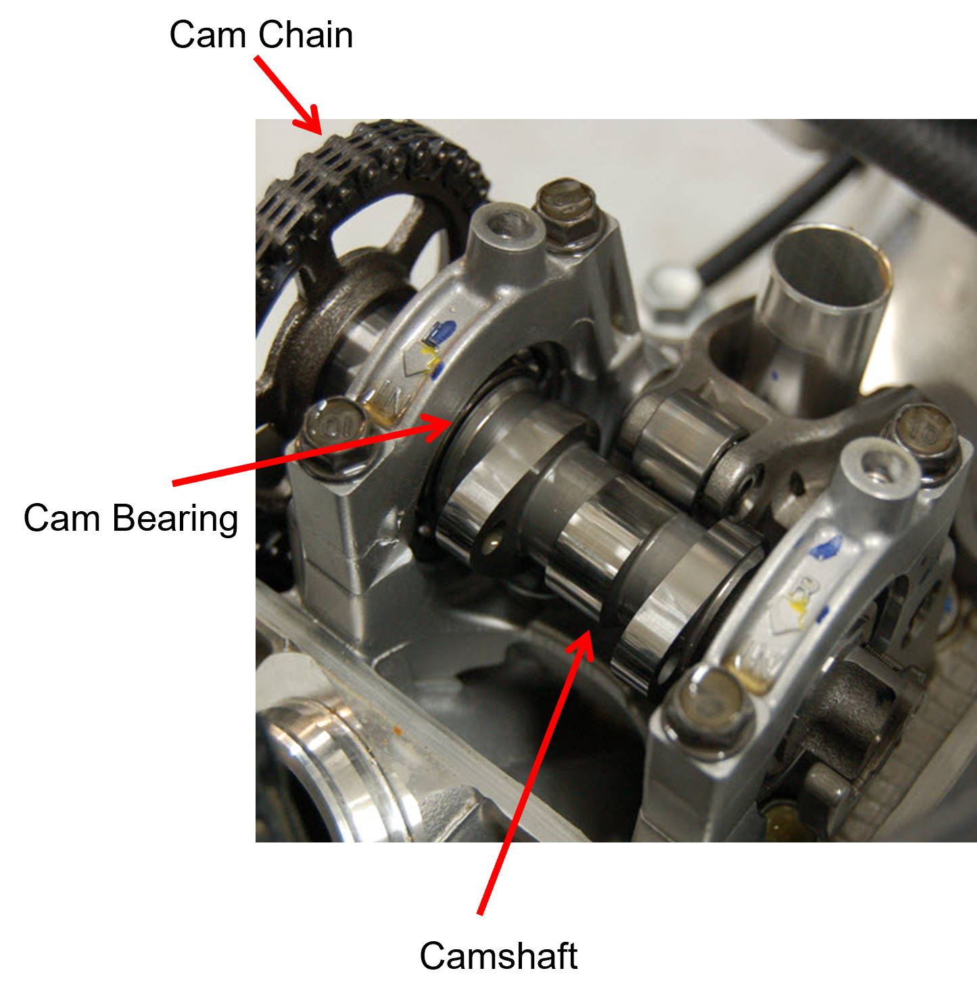
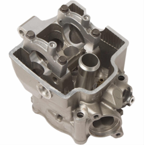
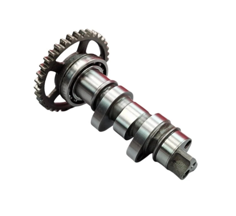
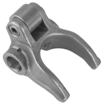
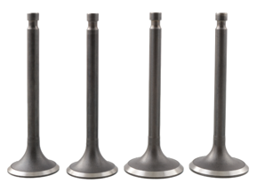
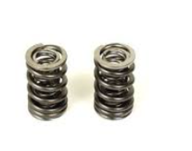
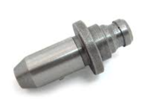
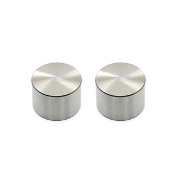
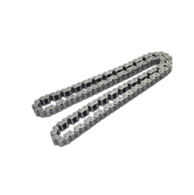
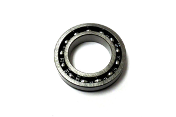

# Phase 1 – System Understanding and Conceptual Design

  

*Figure 1: Layout of the CRF250R Unicam valvetrain.*

| Component | Visual |
|----------|--------|
| **Cylinder Head**  
This component provides the structural support and alignment for the camshaft bearings, valve guides, and rocker arm pivots. |  |
| **Camshaft**  
The camshaft controls valve timing and lift. Intake valves are directly actuated via cam–follower contact, while exhaust valves are actuated through cam–rocker contact. |  |
| **Rocker Arm**  
Located on the exhaust side, the rocker arm transfers cam motion to the exhaust valves, allowing for a more compact system layout. |  |
| **Valves**  
Intake valves allow the air–fuel mixture into the cylinder while exhaust valves release combustion gases. The valves are subjected to repeated impact loading, bending, and high-cycle fatigue. |  |
| **Valve Springs**  
The valve spring closes the valve after cam actuation and maintains follower contact. It must be stiff yet durable, typically made from chrome-silicon steel due to its fatigue resistance at high RPM. |  |
| **Valve Guides**  
Valve guides maintain valve alignment during motion and facilitate heat transfer from the valve to the cylinder head. Excessive wear can lead to oil consumption and poor sealing. |  |
| **Valve Bucket (Follower)**  
The valve bucket sits between the cam lobe and valve stem, transmitting cam motion while reducing friction and wear. It also maintains proper lift and alignment within the valvetrain. |  |
| **Timing Chain**  
The timing chain synchronizes camshaft and crankshaft motion, using guides and a tensioner to maintain proper chain tension and reduce vibration. |  |
| **Camshaft Bearings**  
Camshaft bearings support the camshaft and transfer loads to the cylinder head, reducing friction and ensuring smooth rotation at high engine speeds. |  |
