# Phase 2 – CAD & Analysis

## Overview
  The final design consists of a mechanically actuated valve train integrated within a cylinder head assembly. The purpose of this system is to control the timing and motion of intake and exhaust valves through rotational input from a camshaft. This design converts rotational motion from the camshaft into oscillatory motion of the rocker, and finally into the linear motion of the intake and exhaust valves. 

  The system operates by rotating three separate cam lobes, of which one periodically contacts the rocker arm and the other two contact the intake valve buckets to cause linear motion, as well as a repeated cycle. Once the cam lobes contact either the rocker arm or the valve buckets, the corresponding valves are pushed down, and once the lobe is no longer making contact with the rocker arm, a restoring force provided by a spring is applied to the corresponding valves, which causes them to rise back to the starting position. This process repeats continuously, with valve actuation that is governed by the camshaft geometry to enable controlled airflow into and out of the cylinder. 

### CAD

  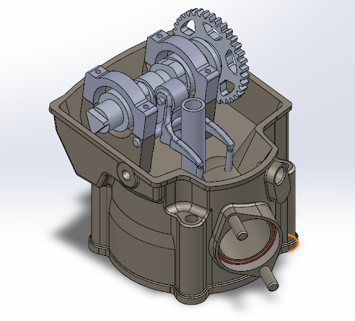

  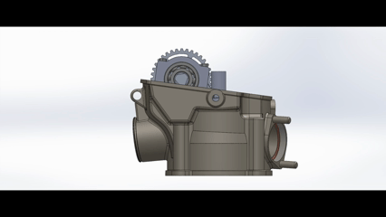

### Analysis
Analysis performed in MathCAD

  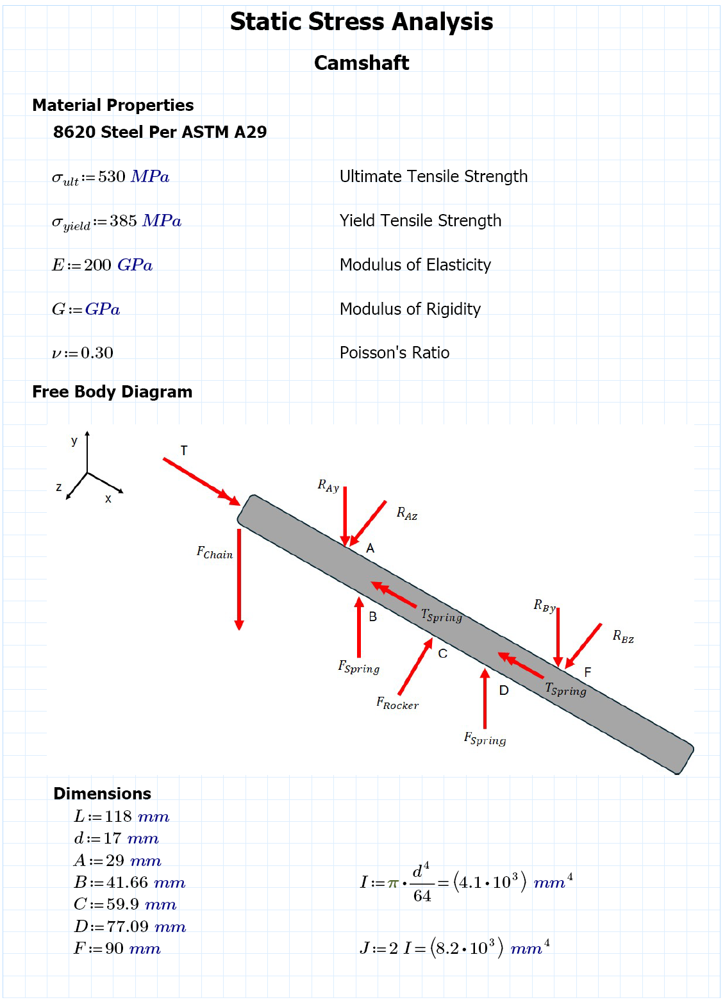

  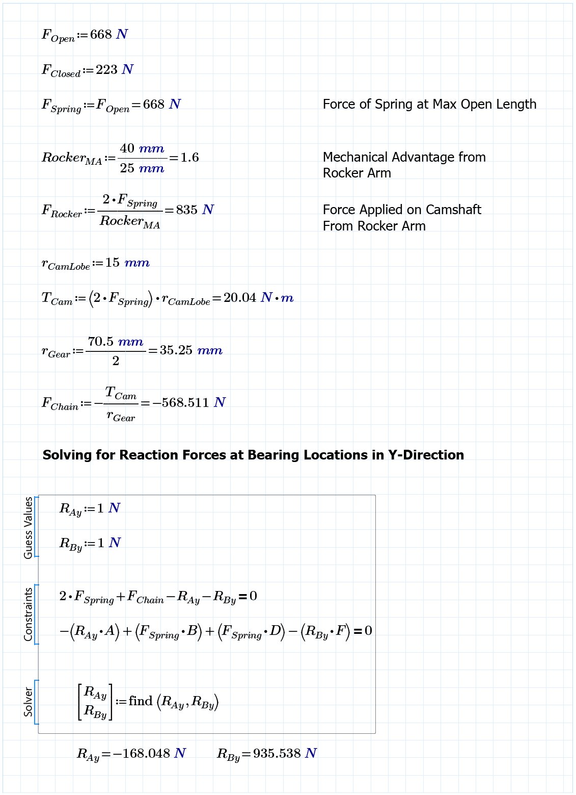

  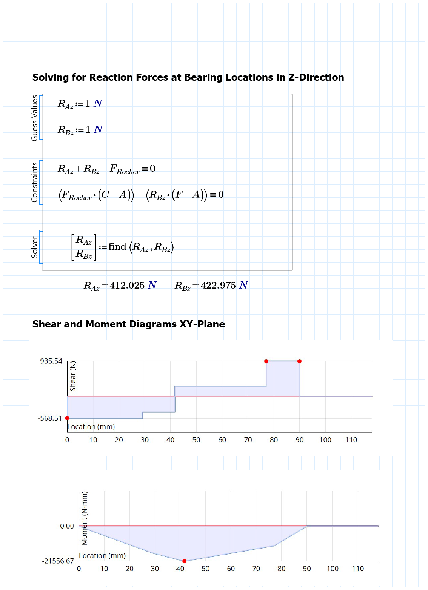

  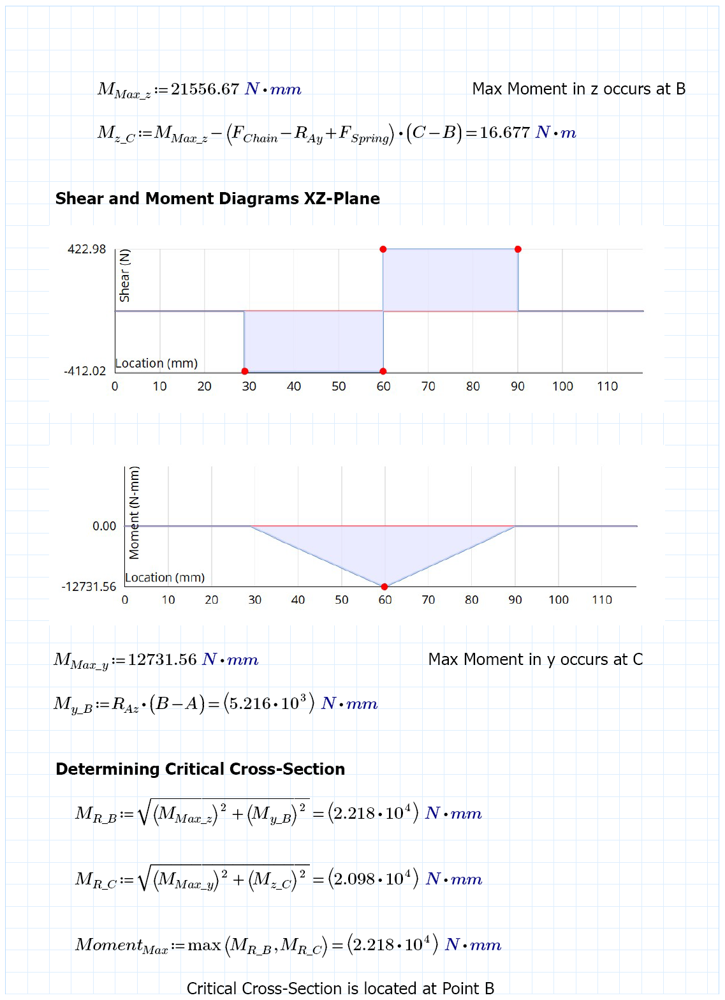

  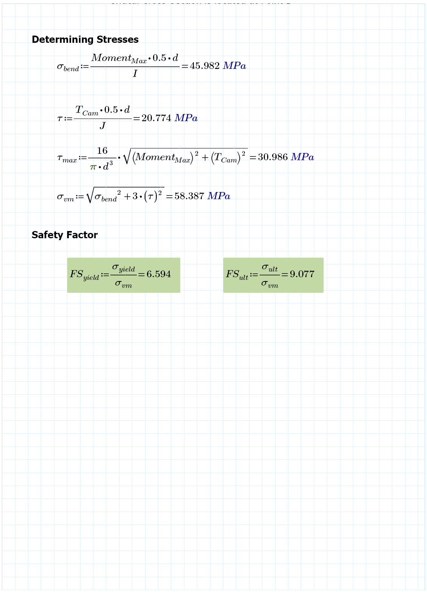

  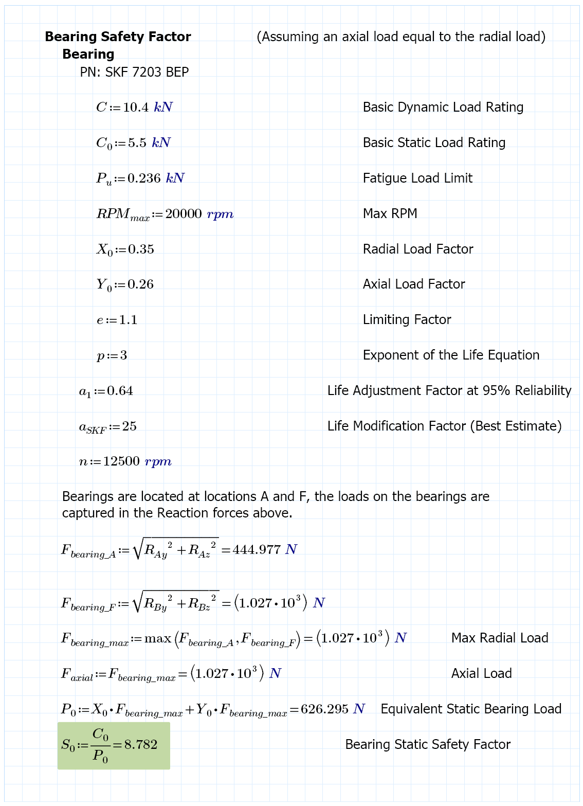

  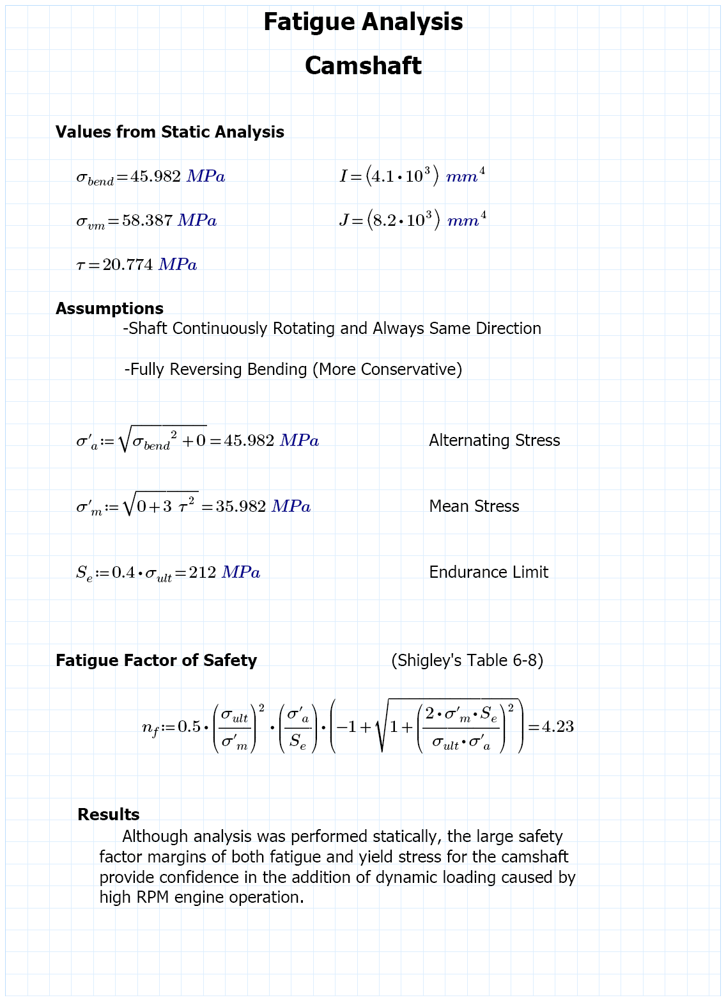

  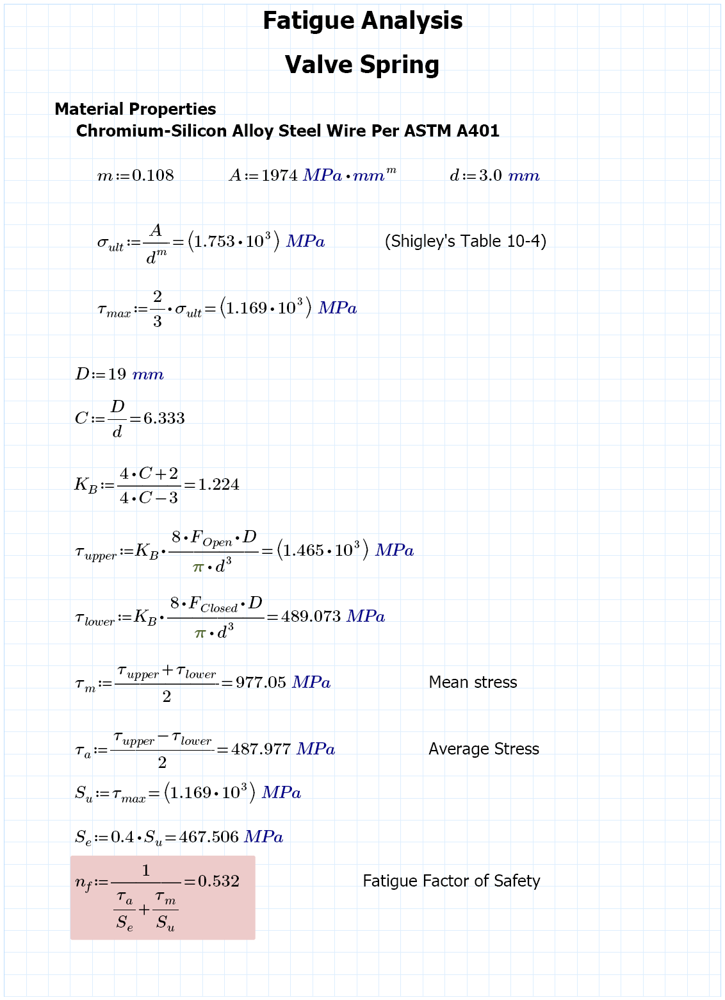

  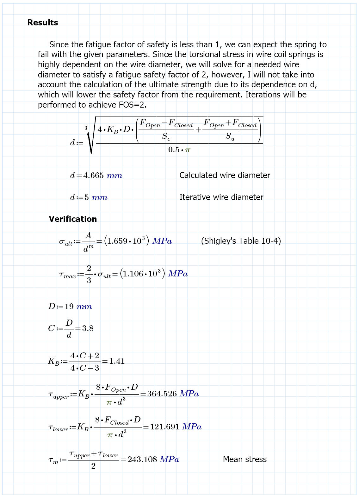

  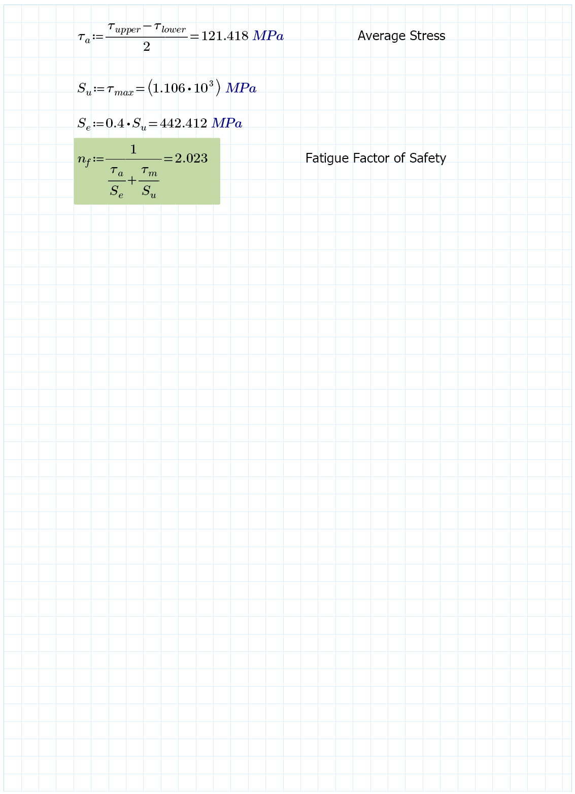

---

### Discussion of design for assembly and design for 3D printing
Design for Assembly
The valve train system was designed with a focus on simplicity and modularity. Components such as the camshaft, rocker arm, roller, and valves are arranged along a primary shaft, allowing for a straightforward, sequential assembly process. Pin-based connections enable rotational motion while keeping interfaces simple and easy to install or remove.
Threaded connections are reinforced using brass inserts with stainless steel fasteners, improving durability and preventing thread wear in printed parts. The design also supports subassembly of smaller components before final integration, reducing overall assembly complexity. A key limitation is the reliance on proper alignment between moving components, particularly at the camshaft and rocker interface. Misalignment or improper installation of small components such as pins and rollers may lead to increased friction or binding.
Design for 3D Printing
All components are designed for FDM 3D printing using PETG with a 0.16 mm layer height, two wall loops, and 15% infill. These settings provide a balance between print efficiency and sufficient strength for prototyping. The calculated bending stress is well below the material yield strength, indicating the design is not highly loaded.
However, 3D printed parts exhibit anisotropic behavior, making print orientation critical for strength in load-bearing components. The relatively low infill may reduce stiffness, particularly near contact regions such as the cam–roller interface. Additionally, print tolerances and surface finish may require minor post-processing to ensure smooth operation. The use of brass threaded inserts improves the reliability of fastened connections, making the design more suitable for repeated assembly and use.

Updated list of anticipated risks or weaknesses:

Material Used:

With the usage of PETG, the difference in strength and stiffness for PETG compared to Metal, poses a risk of deformation of the model with repeated testing. As well as friction or lubrication causing our material to be worn down over time due to the other model components. This causes the model's structural integrity to decline and deform over time, which affects our critical points that can lead to the fracture of our model.

Printing Errors:

Due to 3D printing not always being precise, we could run into issues regarding the stability and failure risk of our model. Due to the infill or layering issues, our print must not have any structural imperfections. Especially in high stress areas, any minor 3D printing issue can cause our model to fracture or simply not work. We must ensure our 3D print has tolerances which allow all parts to fit, which ensures the parts don’t come into contact with one another causing friction, or simply aren’t too loose to cause vibrations.

Components used:

With using springs, we run into the issue that cyclic loading of the valve springs can lead to fatigue and eventual failure, reducing their ability to properly control the valves. Spring failure may cause gear wear and misalignment of the camshaft. Our valve float always runs the risk of our valve springs not being able to close the valve fast enough at high RPMs, which causes loss of contact with the cam lobe and potential valve-to-piston contact. Also our cam lobe can have high contact stresses between the cam lobe and follower or rocker interface can lead to surface fatigue, pitting, or scuffing, especially under inadequate lubrication or high spring loads. This wear alters the cam profile over time, reducing effective valve lift and changing valve timing. In severe cases, material loss can accelerate further wear and lead to catastrophic valvetrain failure.

