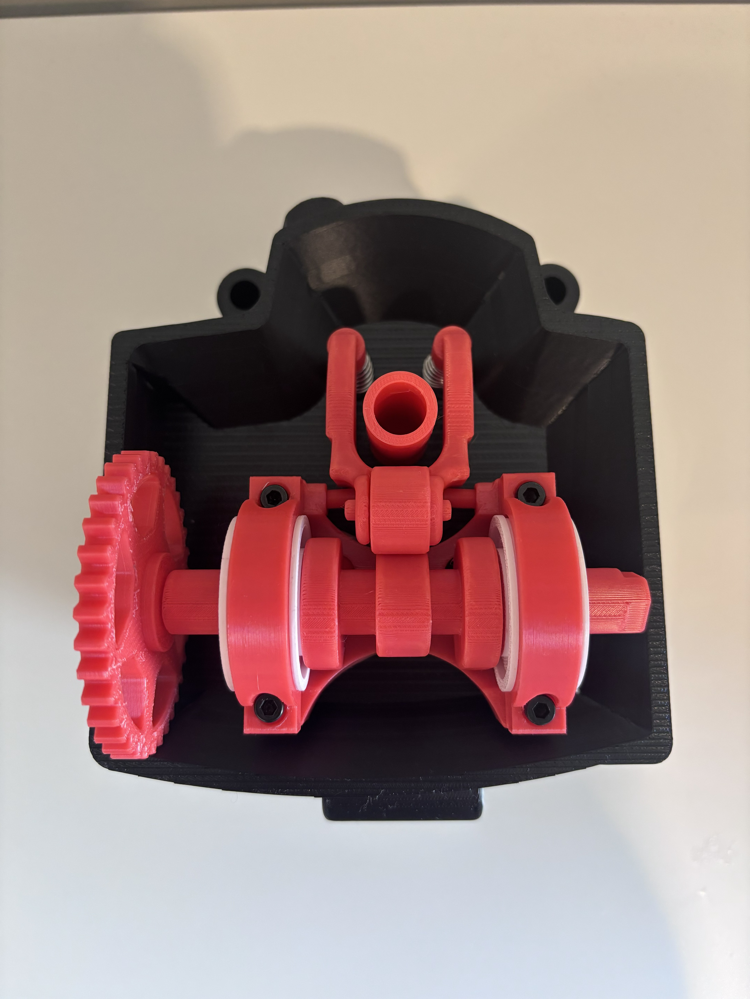
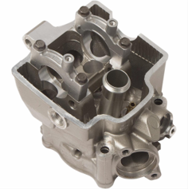
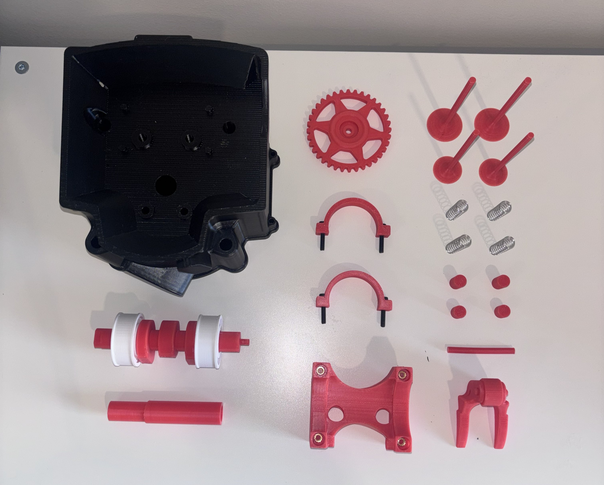
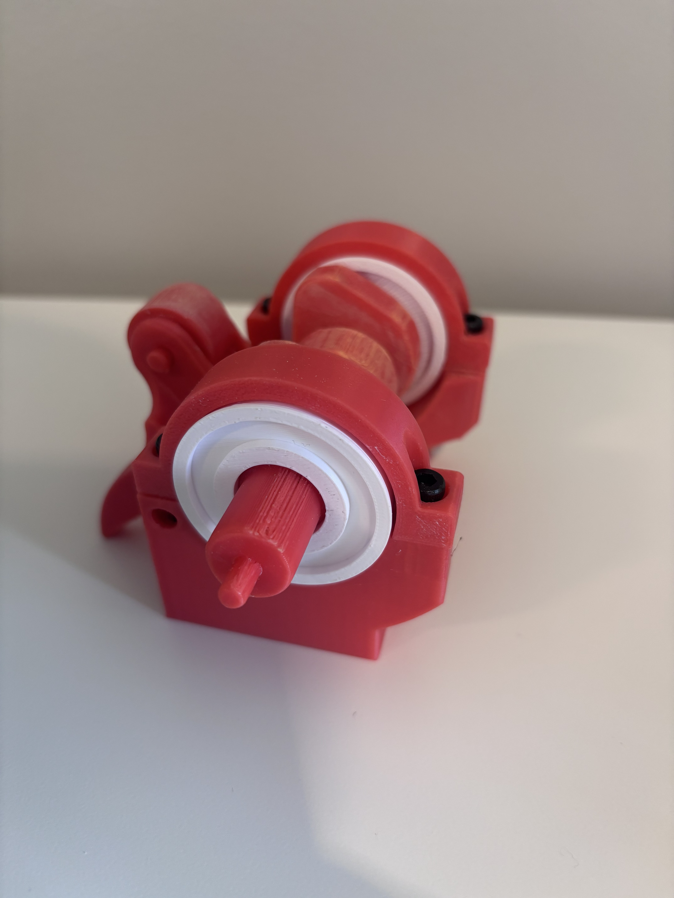
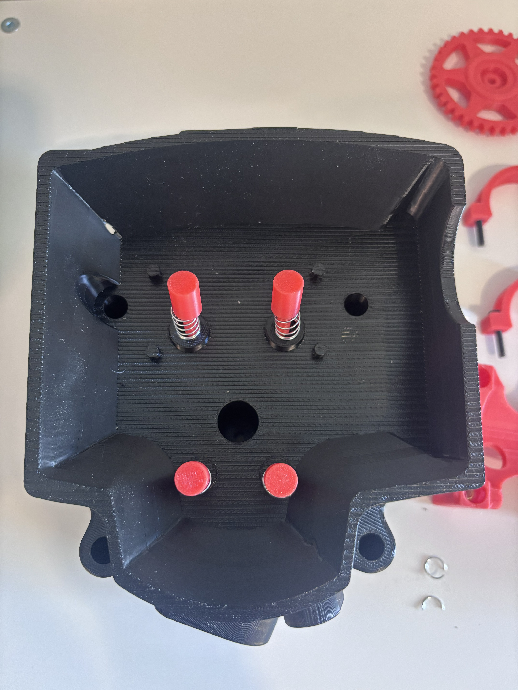
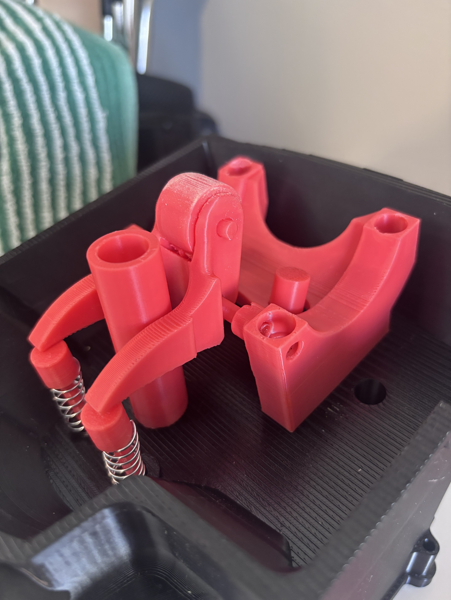
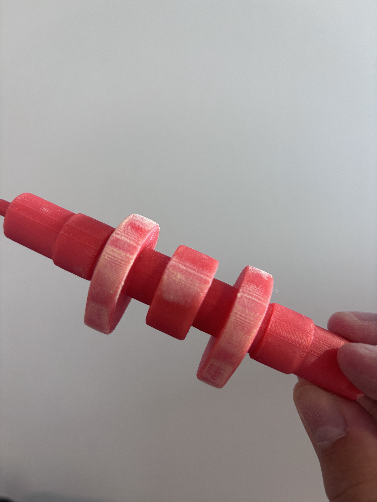
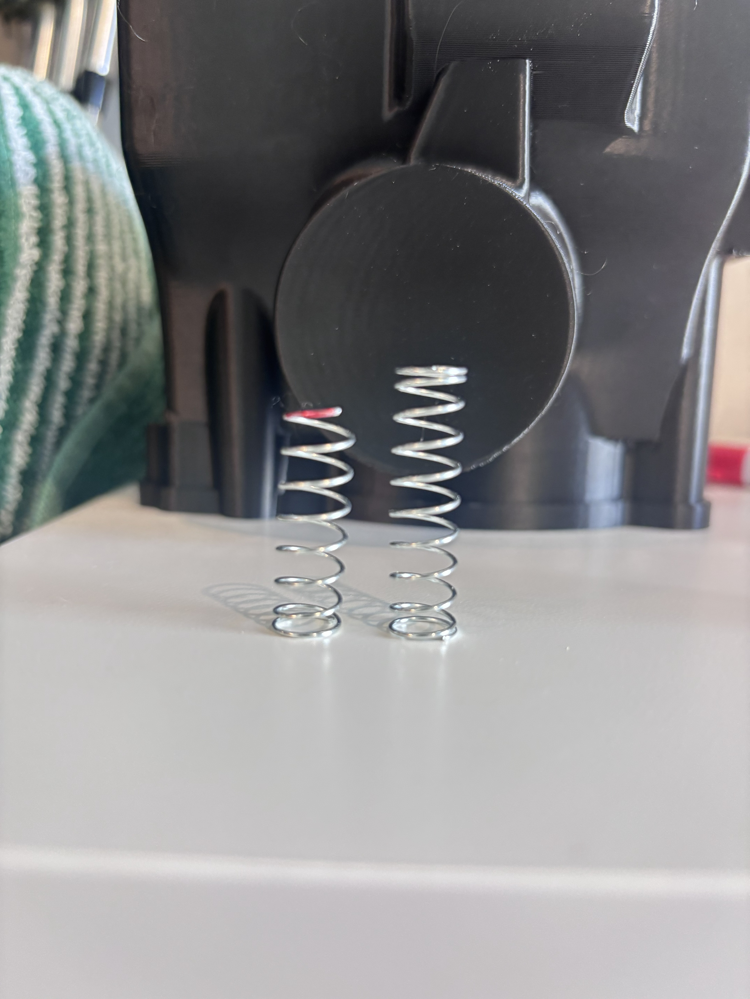
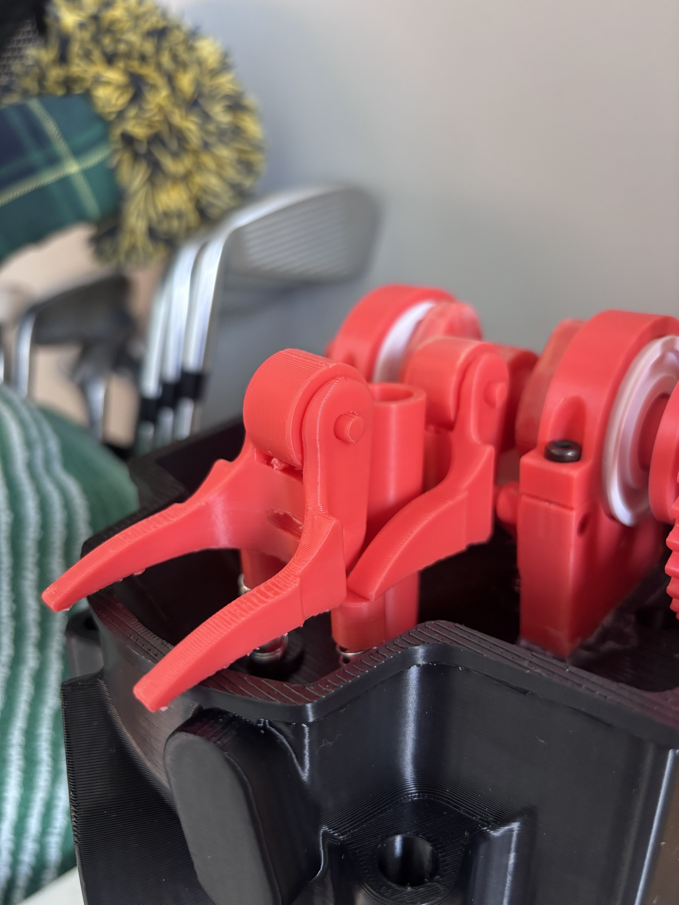

# Phase 3 - Prototyping, Testing & Reflection

    

## Fabrication Details
  Our valve train prototype was fabricated using PETG filament, brass threaded inserts, and springs. All 3D components were printed using PETG filament, which was selected for its balance of strength, durability, and ease of printing. A layer height of 0.16 mm, two wall loops, and 15% infill were used to obtain a balance between print efficiency and structural integrity. Supports were incorporated as needed, and the print orientation was strategically selected to maximize strength along primary load-bearing directions. The use of a relatively low infill density was justified by the Phase 2 analysis, which indicated that the system would not be subjected to significant structural loads. The brass threaded inserts and springs were sourced from McMaster-Carr.

  

## Assembly Procedure 
  The assembly process was completed as follows. The valves were first positioned within the cylinder head, followed by the installation of the valve buckets and springs. The rocker arm and roller were then mounted using pin connections. Finally, the camshaft was positioned in bearings, then the remaining structural components were secured using threaded fasteners. The modular design allowed certain components to be assembled into subassemblies before final integration, thereby reducing overall assembly complexity.
  

  

  

  

  

## Test Procedures, Results, and Interpretation
  The prototype was evaluated by manually rotating the camshaft to simulate normal system operation. The objective of this test was to assess valve actuation, motion smoothness, and timing consistency. Observations were made through visual inspection, as well as by evaluating resistance and continuity throughout the motion cycle. The system successfully demonstrated the intended conversion of rotational input into both oscillatory and linear valve motion. Valve actuation followed the expected cyclic behavior dictated by the cam geometry, confirming the validity of the fundamental mechanism design. However, noticeable resistance was encountered during operation, and minor inconsistencies in valve motion were observed. These variations were primarily attributed to alignment issues and inconsistencies in part fit. The results indicate that, while the mechanism performs as designed in principle, real-world factors have a significant impact on performance. Friction at contact interfaces was higher than anticipated based on the Phase 2 analysis. The use of PETG introduced additional compliance, reducing overall stiffness and allowing minor deformation under load.

## Comparison with Phase 2 Predictions
 In phase 2, the system was evaluated under idealized assumptions, including rigid components, perfect alignment, and negligible friction. Experimental testing confirmed that the predicted motion behavior was generally accurate, as the system successfully achieved the intended valve actuation and timing sequence. However, several discrepancies emerged between the predicted and actual performance. The system exhibited greater frictional resistance than anticipated, which resulted in the motion being less smooth. In addition, its performance proved to be highly sensitive to assembly precision and alignment. These differences can be attributed to several factors. The material properties of PETG differ significantly from the idealized materials used in the analysis, particularly with respect to stiffness and anisotropic behavior. Dimensional variations introduced during the 3D printing process also affected component fit and alignment. Furthermore, key effects such as friction, wear, and deformation were not fully captured in the analytical model. While the Phase 2 analysis provided a valuable baseline for the design, the experimental results underscore the importance of accounting for real-world conditions in engineering predictions.

## Failures, Mistakes, and Surprises
  During testing, several issues were identified that adversely affected system performance. The major issue was with the first rocker arm. The arm would have too much deflection during cycling, which led to the arms not aligning properly with the exhaust valves. This was solved by increasing the size of the rocker arm as well as reducing the total spring force by cutting the springs down. Wear was observed at key contact interfaces, particularly between the cam lobes and their mating components, as a result of repeated loading and friction. Additionally, the material limitations of PETG introduce a risk of long-term deformation in load-bearing components. Some design and analysis shortcomings contributed to these outcomes. The effects of 3D printing tolerances on assembly and alignment were underestimated, leading to fitment challenges. Friction had a more significant impact on system performance than anticipated, and assembly precision proved to be critical for achieving smooth operation. Despite the relatively low infill, certain components performed adequately due to the modest loading conditions, which was originally expected.

  

  

  

## Design Improvements for Second Iteration
Based on the observed performance and identified issues, several improvements are recommended for a subsequent design iteration. Increasing infill density or wall thickness in high-stress and contact regions would enhance stiffness and reduce deformation. Dimensional tolerances should be refined to better account for the variability inherent in the 3D printing process, thereby improving component fit and alignment. Incorporating additional alignment features, such as guides or locating geometries, would promote consistent assembly and reduce sensitivity to installation errors. Frictional losses could be minimized through improved surface finishing or the application of lubrication at contact interfaces. Critical components may also benefit from the use of higher-strength materials or optimized print parameters to improve durability. 
